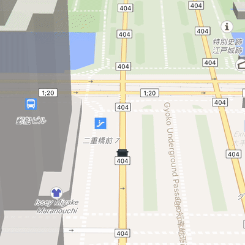

# Flutter GPU map scene

This sample uses `gpuMapRenderCallback` to draw custom 3D cars and buildings
anchored to geographic coordinates.

  

- Cars follow road geometry returned by OSRM.
- Map taps place buildings at geographic locations.
- `MapLibreGpuMapTransform` projects geographic coordinates into map space.
- Custom models and map buildings share geographic depth.

## CC0 assets

The car and building models come from Kenney and are available under
[CC0 1.0 Universal](https://creativecommons.org/publicdomain/zero/1.0/).
See [`CC0-ASSETS.md`](CC0-ASSETS.md) for exact sources.

Road geometry comes from the public
[OSRM route service](https://project-osrm.org/) using
[OpenStreetMap data](https://www.openstreetmap.org/copyright).
© OpenStreetMap contributors, ODbL 1.0.
